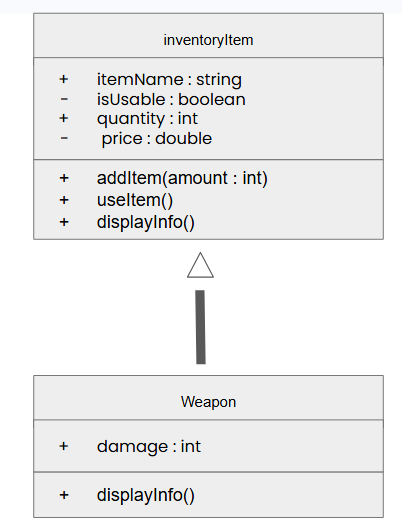
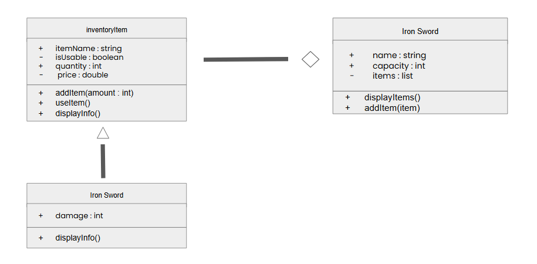
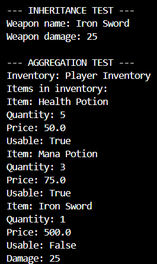
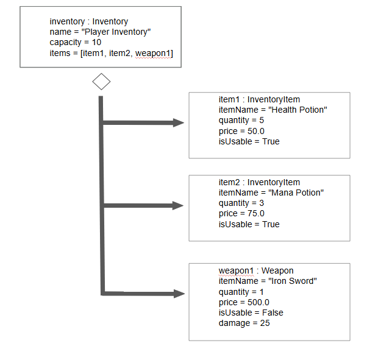

# Advanced Class Relationships
## Previous Activities
[classAttrib](classAttributesMethods.md)
[classRel](classRelations.md)
## Existing System Description:
A game inventory system that manages different items. The inventoryItem stores information about each item while the Inventory stores them.
## Inheritance Relationship
Parent: inventoryItem
Child: Weapon
Explanation: An weapon is an inventoryItem. It can reuse the attributes and methods of InventoryItem, but will also have its own damage attribute.
## Inheritance UML

## Composition/Aggregation
Relationship: Aggregation
Explanation: The Inventory stores inventoryItems but items can exist without the inventory. The Inventory only recieves already-made items.
## Advanced UML Diagram

## Python Implementation
[Source Code](advancedRelationships.py)
## Test Run

## Object Diagram

## Reflection
Answers:

1. I chose Weapon as the child class of InventoryItem because a weapon is a type of inventory item. It has the same information as other inventory items, but it has a damage attribute.

2. It allows the weapon class to use the attributes and methods from the inventoryItem class.

3. I used aggregation because an Inventory contains InventoryItems, but the items can exist independently.

4. In Part III the association showed that the Inventory is connected to many inventoryItems. In Part IV it shows that the Inventory stores items that can exist independently through aggregation.

5. My design follows DRY since the code from inventoryitem is reused for the inventory by the weapon class. I did not need to re write same attributes and initialization.
