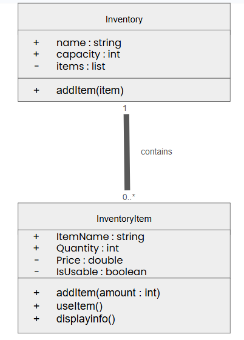

# Class Relationships: Association and Multiplicity
## Previous Work
[Part I - Classes and Objects](classObjectUML.md)
[Part II - Class Attributes and Methods](classAttributesMethods.md)
## Existing Class
Class: inventoryItem

Description: An InventoryItem represents an item that is stored in the player’s inventory. It stores information about the item and can perform actions involving it.
## New Related Class
Class: Inventory
Description: It represents the player's collection of items. It includes the item's name, description, and whether it can be used.
## Association
Relationship: Inventory contains inventoryItem
Explanation: The Inventory class is connected to the inventoryItem class because an inventory can hold multiple items.
## Multiplicity

Multiplicity: Inventory 1 ───────── 0..* inventoryItem
Explanation: One Inventory can contain zero or multiple inventoryItems
## UML Class Relationship Diagram

## Python Implementation
[View Python Source](classRelationships.py)
## Test Run

## Object Relationship Diagram

## Analysis
### What is the association between your two classes?
### What multiplicity did you choose and why?
### How did you implement the relationship in Python?
### Why did you store an object reference instead of copying its data?
### If your relationship uses many, why is a list appropriate?
